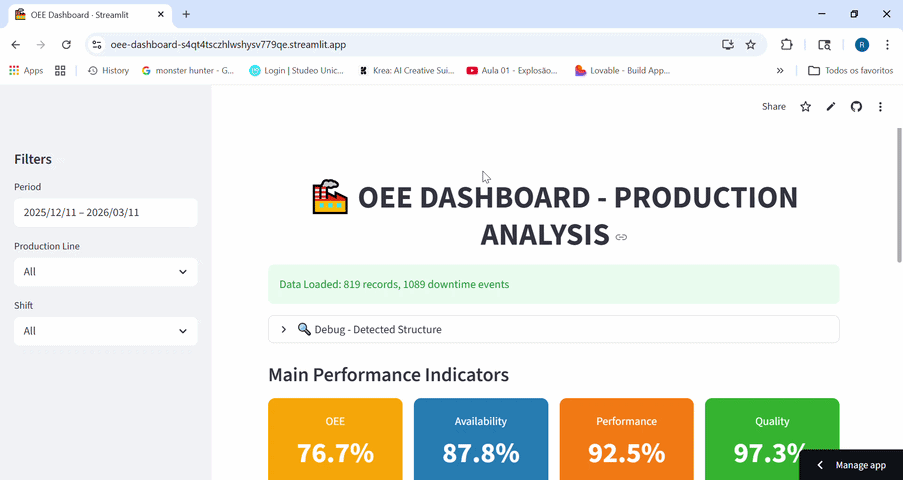
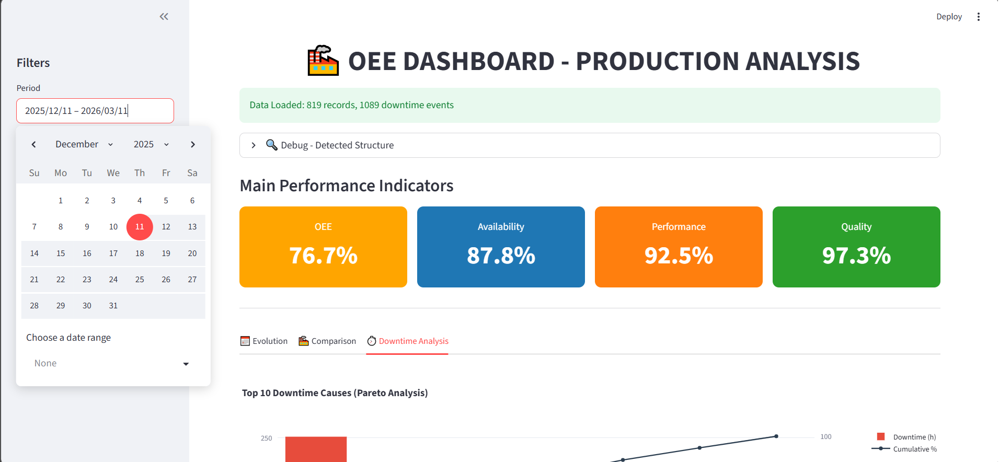
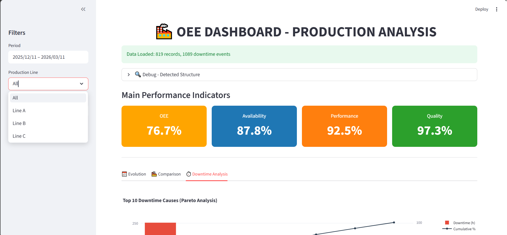
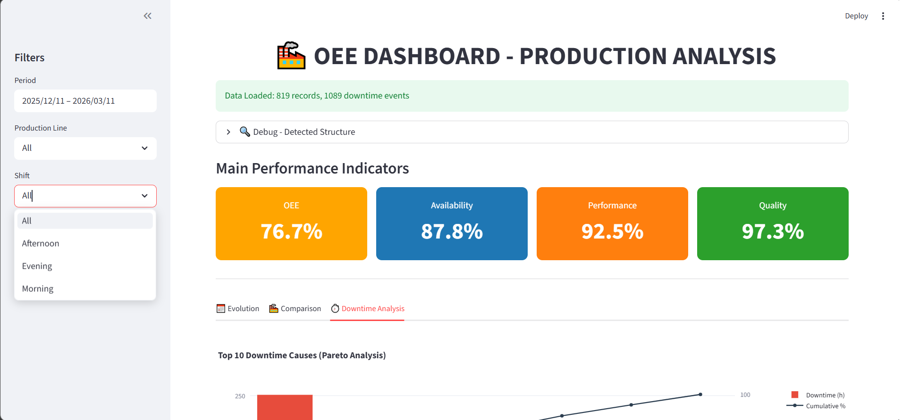
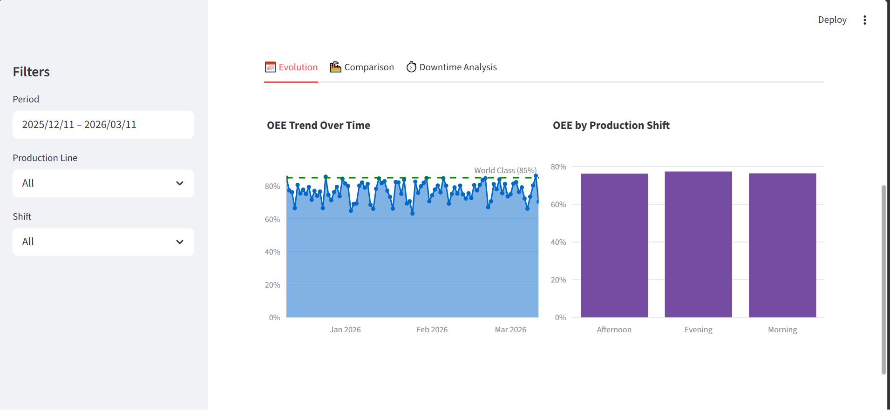
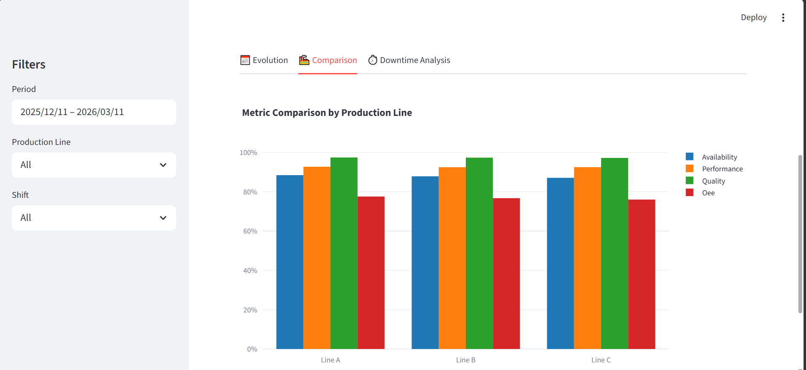
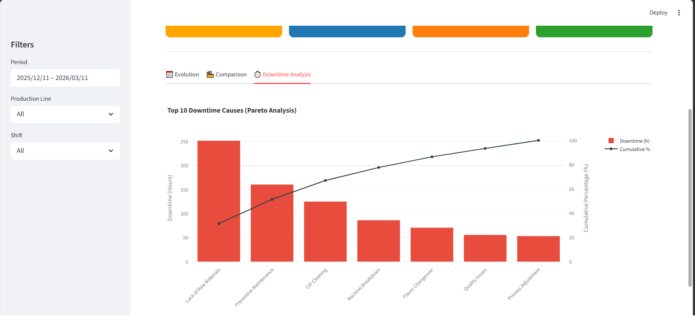

# OEE Dashboard - Industrial Data Portfolio

  This repository serves as a technical demonstration of my skills in <b>Data Engineering, Backend Integration (SQLite), and Frontend Visualization (Streamlit)</b>. It simulates a real-world Industry 4.0 scenario: monitoring Overall Equipment Effectiveness (OEE) in a dairy production line.

  

  
  
  

---

## 🎯 Project Objective
The goal of this project is to demonstrate a full-cycle data solution:
1. **Data Ingestion**: Handling raw production data.
2. **Data Transformation**: Processing and cleaning data using Python/Pandas.
3. **Storage**: Structuring and querying a local SQLite database.
4. **Insight Delivery**: Building an interactive dashboard for decision-making.

## 🛠️ Tech Stack & Skills Demonstrated
* **Python**: Core logic, data manipulation, and automation.
* **Pandas & NumPy**: Complex data cleaning and KPI calculations (OEE formulas).
* **SQLite**: Database schema design and SQL integration.
* **Streamlit**: Rapid development of a web-based UI for data apps.
* **Plotly**: Creating interactive charts (Pareto, Time-Series, Gauges).

## 📊 Key Insights Provided
* **Real-time KPI Tracking**: Instant visibility of OEE, Availability, Performance, and Quality.
* **Downtime Analysis**: Automatic Pareto charts to identify the main causes of efficiency loss.
* **Production Comparison**: Dynamic filters to compare performance across different shifts and production lines.

## 🖼️ Dashboard Preview

### Live Demo Preview

  

### 1. Interactive Filters

| Filter View 1 | Filter View 2 | Filter View 3 |
| :---: | :---: | :---: |
|  |  |  |

### 2. Performance & Pareto Analysis

| Pareto Analysis | Time Series | Quality Metrics |
| :---: | :---: | :---: |
|  |  |  |

---

## ⚙️ Project Architecture
This project is structured to showcase clean code and modularity:
* `Data_Prep.py` & `Tables_Prep.py`: ETL (Extract, Transform, Load) logic.
* `Data_Insert.py`: Database management and SQL operations.
* `Dashboard.py`: UI/UX design and data visualization layer.

---
**Note:** This is a portfolio project and is not intended for production use. It aims to showcase technical proficiency in the Python data ecosystem.

**Contact:** [Ricardo Serenato Junior](https://www.linkedin.com/in/ricardoserenatojr)  
**Email:** [ricardoserenato@gmail.com](mailto:ricardoserenato@gmail.com)